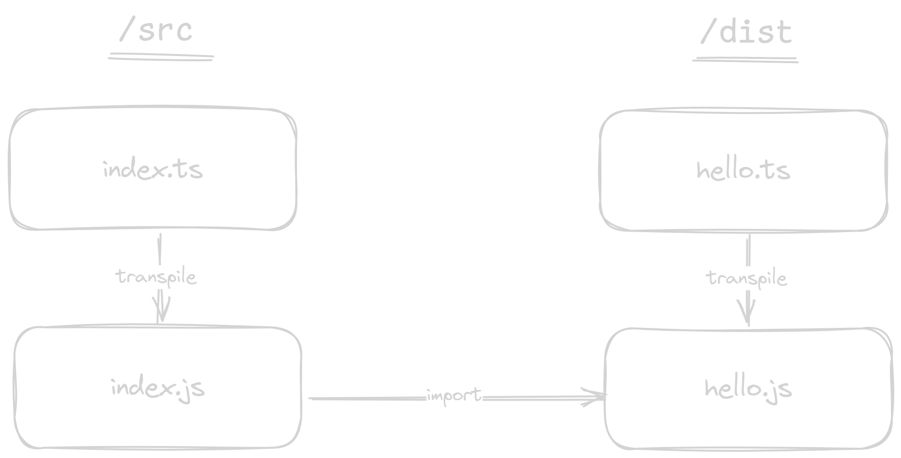

# 02 The `moduleResolution: nodenext` Option in `tsconfig.json`

- TypeScript has a `moduleResolution` option in `tsconfig.json`, that enables it to use different module resolution
  algorithms. Most are a relic of a bygone error, but two are really useful. Let's start with...

- `moduleResolution: nodenext` means that module resolution follows the Node.js resolution algorithm for CommonJS
  (if it's a CommonJS file) or ESM (if it's an ESM file).

- Notice the import - `import {hello} from './hello.js'`. Why is it `./hello.js` and not `./hello.ts`?

- Because TypeScript will _not_ touch the specifier when transpiling! This is a rule that TypeScript follows
  because TypeScript doesn't want to modify the code, only remove the types.

- This is how the transpilation proceeds.

- So if TypeScript is not "allowed" to touch the specifier,
  then the import in `index.js` MUST work, and thus MUST be `./hello.js`.

- But there is _no_ `hello.js` file in the folder! Only `hello.ts`.
  So how does this work?

- TypeScript _reverse engineers_ (or inverse maps) the `hello.js` to `hello.ts`
  because it understands that the file `./hello.js` is what the `hello.ts` will
  transpile to.
