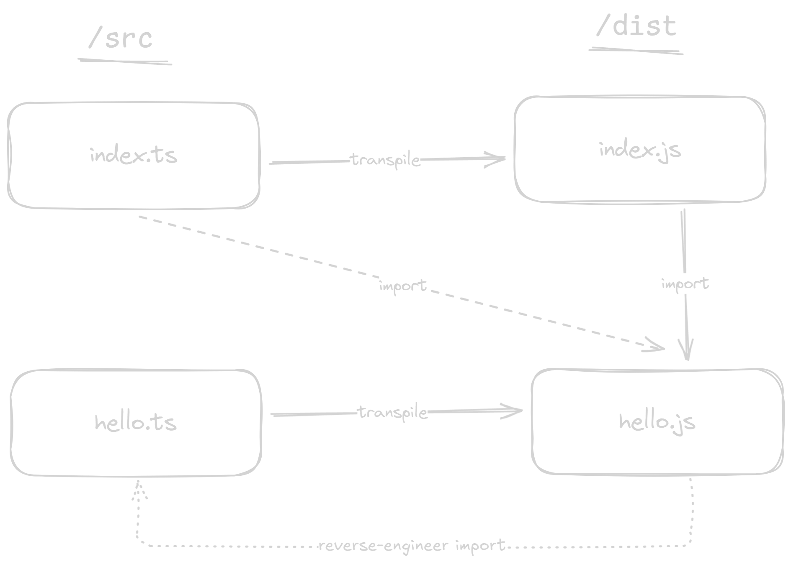

# 02 The `moduleResolution: nodenext` option in `tsconfig.json`

- TypeScript has a `moduleResolution` option in `tsconfig.json`, that enables it to use different module resolution
  algorithms. Most are a relic of a bygone era, but two are really useful. Let's start with...

- `moduleResolution: nodenext`

- This optionn means that module resolution follows the Node.js resolution algorithm for CommonJS
  (if it's a CommonJS file) or ESM (if it's an ESM file).

- So it follows the rules that I explained in our lessons around Node.js module resolution.

- Notice the import - `import {hello} from './hello.js'`. Why is it `./hello.js` and not `./hello.ts`?

- First, we need to understand that TypeScript transpiles
  both `index.ts` and `hello.ts` to the `/dist` directory:

- The second thing we need to understand is that TypeScript does _not_ want to change anything in
  the code that is not type-related, and the import specifier
  (`import {hello} from '_import_specifier_'`) is not type-related so the final code in `dist`
  must leave it untouched.

- This means that to make the final code in `dist` work, the specifier must be `./hello.js`.

- This is how the transpilation proceeds. But this means
  that the import specifier in `src` does _not_ point to the original `.ts` file, but rather
  to where the original `.ts` file will be transpiled to!

- So TypeScript has to "reverse engineer" the intent of the specifier
  and "figure out" what the original source code is!

- TypeScript _reverse engineers_ (or inverse maps) the `hello.js` to `hello.ts`
  because it understands that the file `./hello.js` is what the `hello.ts` will
  transpile to.
